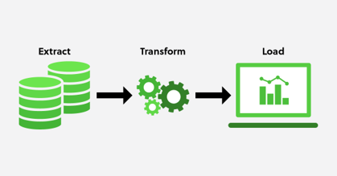
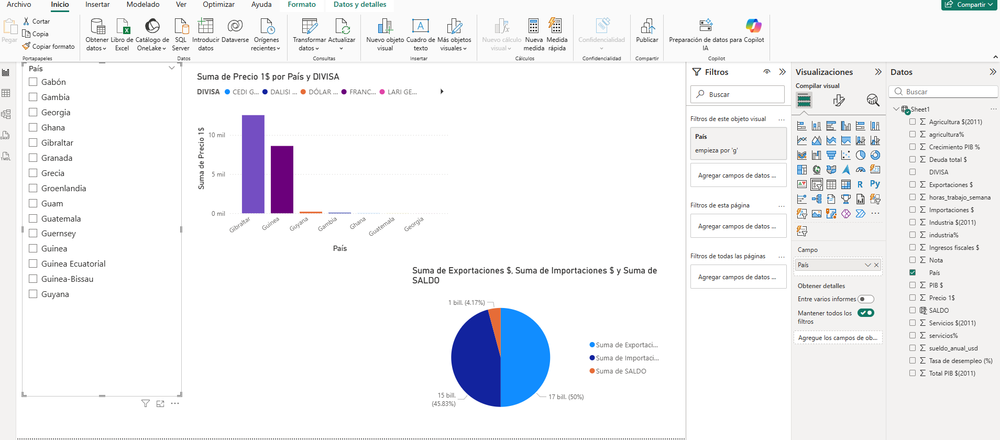
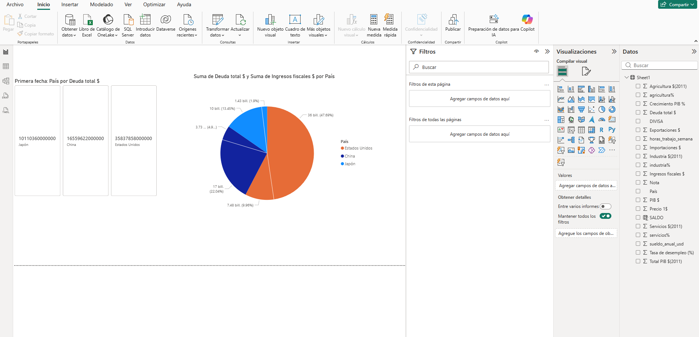
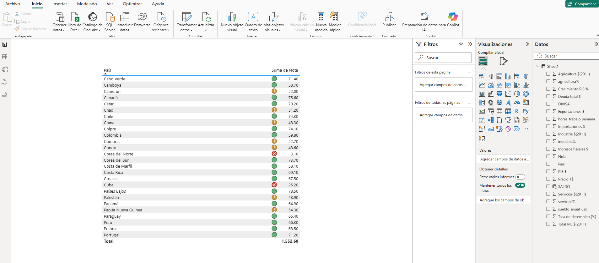

# Universidad de San Carlos de Guatemala
# Facultad de Ingeniería
# Escuela de Ciencias y Sistemas
# Economía Sección A+ 
# Licenciada Ileana Ralda
# Tutor Académico: Kevin Estuardo Sotoj García - 201710130

<br>

# Conferencia del Curso - 15 de abril de 2026
<br>
<br>

<h1 style="text-align: center;"><b>Análisis y Transformación de Datos usando Excel, Python y PowerBI</b></h1>

<br>
<br>

<div style="text-align: justify;">
En esta conferencia, se dio a conocer cómo podemos analizar y transformar datos utilizando herramientas tecnológicas como Excel y Python con su librería Pandas, además de poder visualizar de manera gráfica dichos datos utilizando Microsoft PowerBI.

Este proceso de transformar los datos, es conocido como ETL (Extract, Transform, Load), el cual se refiere a la extracción de datos de diversas fuentes, su transformación para adecuarlos a un formato específico y finalmente su carga en una base de datos o sistema de análisis.

De forma general, se dio un recorrido de extraer la información de diversas fuentes, organizarla en Excel, limpiarla y transformarla manualmente con funciones de Excel y también con Python y Pandas, para finalmente visualizarla a través de PowerBI.

</div>

### Diagrama del Proceso ETL de forma general




### Diagrama del Proceso ETL utilizando Excel, Python y PowerBI


## Herramientas Utilizadas 
<div style="text-align: justify;">

- **Excel**: Para la organización y análisis básico de datos. Se visualizan los datos recopilados y se muestran en tablas para su fácil comprensión. Se usó la versión de Microsoft Excel 365, (licencia otorgada con el correo institucional de la universidad).

- **Python (Pandas)**: Para la manipulación avanzada de datos, limpieza y análisis. Se debe tener instalado Python en el sistema, en este caso se usó la versión 3.13.6. Se debe tener también instalada la libreria de pandas, la cual se instala usando el comando: `pip install pandas`. 
Pandas es una librería de Python que realiza análisis de datos y manipulación de datos. Permite trabajar con estructuras de datos como DataFrames, que facilitan la limpieza, transformación y análisis de grandes conjuntos de datos.

- **PowerBI**: Para la visualización de datos a través de gráficos interactivos. Se usó la versión de Microsoft PowerBI Desktop, (licencia otorgada con el correo institucional de la universidad).

</div>


## Proceso de Análisis y Transformación de Datos


<div style="text-align: justify;">

1. **Recopilación de todos los datos**: Se recopilaron datos de diversas fuentes las cuales se detallan al final del documento, se organizaron en diversos archivos de Excel, para su posterior análisis. Los datos están tal cual se recopilaron, sin ningún tipo de transformación, formato o limpieza.
Estos están almacenados en la carpeta `datos-originales` dentro de la carpeta `datoscrudos`.

                      📂 datoscrudos
                      ├── 📂 datos-originales
                           ├── 📗 deudapublica.xlsx
                           ├── 📗 export-import.xlsx
                           ├── 📗 libertadeconomica2026.xlsx
                           ├── 📗 PIB-2025.xlsx
                           ├── 📗 recaudaciontributaria.xlsx
                           ├── 📗 salariosminimos.xlsx
                           ├── 📗 SECTORES-2011.xlsx
                           ├── 📗 tasadesempleo.xlsx
                           └── 📗 TIPO-CAMBIO.xlsx


2. **Centrar la información en un solo archivo de Excel**: Se creó un nuevo archivo de Excel llamado `TODOS-DATOS.xlsx` el cual se encuentra en la carpeta `datoscrudos`, dentro de este se crearon diversas hojas, cada una con el nombre del tema al que corresponden los datos, y se copiaron los datos de cada uno de los archivos originales a su respectiva hoja en el nuevo archivo.

                      📂 datoscrudos
                      ├──  📗 TODOS-DATOS.xlsx

- Existe una hoja llamada `TODOS-DATOS` en la cual se agregaron todos los datos de las demás hojas, para tener toda la información en un solo lugar. se usaron funciones de Excel para organizar y transformar los datos, entre las cuales se encuentran:

    - `=SI.ERROR(BUSCARV(A7;Tabla18;3;FALSO);" no está")`: esta funcion se usó para buscar datos en una tabla y devolver un valor específico, en caso de que no se encuentre el valor buscado, devuelve un mensaje de error personalizado, donde `A7` es el valor que se busca, `Tabla18` es el rango de la tabla donde se busca el valor, `3` es el número de columna de la tabla de donde se devolverá el valor si se encuentra, y `FALSO` indica que la búsqueda debe ser exacta, si no se encuentra el valor, devuelve el mensaje "no está".

    - `=ESPACIOS(SUSTITUIR(A2;CARACTER(160);""))`: esta función se usó para eliminar espacios adicionales en los datos, donde `A2` es la celda que contiene el texto a limpiar, `CARACTER(160)` representa un espacio no separable, y `SUSTITUIR` reemplaza ese espacio con una cadena vacía, mientras que `ESPACIOS` elimina cualquier espacio adicional al principio o al final del texto.

    -"Albania [+]"  `=SUSTITUIR(A2;"[+]";"")` esta función se usó para eliminar el texto "[+]" de los datos, donde `A2` es la celda que contiene el texto a limpiar, y `SUSTITUIR` reemplaza el texto "[+]" con una cadena vacía.

- Al tener toda la información a la vista, se visualiza que hay datos que no tienen un formato adecuado, por ejemplo tienen coma decimal, en vez de punto decimal, usan punto para separar miles, usan el guión largo para delegar números negativos, además, se usó la función de `ESPACIOS` ya que algunos datos tenían espacio adicional al principio, no el espacio normal que se usa, el ASCII 32, sino el ASCII 160, el cual es un espacio no separable, con este espacio no se lograba buscar bien la información ya que se hizo por países y retornaba que no encontraba el valor. Así también, de los datos extraídos, algunos tenían el texto "[+]" al final del nombre del país, lo cual se eliminó con la función `SUSTITUIR` para que el nombre del país quedara limpio y se pudiera buscar sin problemas.

- Con esto, se logró tener toda la información en un solo archivo de Excel, pero realmente resulta tedioso, confuso y demasiado tardado, ya que requiere de mucho trabajo manual y no perder la sintonía de lo que se va haciendo. Al ser la parte práctica de la conferencia, sabemos qué datos estamos manejando, pero en un entorno real, en un entorno con miles de datos, incluso millones de datos, este proceso se vuelve imposible de realizar manualmente. Por tal motivo se hizo el mismo proceso pero utilizando Python y la librería de Pandas, para automatizar el proceso, hacerlo más rápido, eficiente y con menos margen de error.

3. **Automatizar el proceso utilizando Python y Pandas**: Se creó un archivo de Python llamado `limpiararchivosexcel.py` el cual se encuentra en la carpeta `scripts`, dentro de este se escribió el código para automatizar el proceso de análisis y transformación de datos utilizando la librería de Pandas, el código se divide en diversas partes, y se ejemplifican algunas columnas por cada archivo Excel.

                      📂 scripts
                      ├──  📘 limpiararchivosexcel.py

- Se importan las librerías necesarias, en este caso `pandas` para la manipulación de datos y `os` para manejar las rutas de los archivos.
- Se definen las rutas donde están los archivos con los datos crudos y se definen también las rutas de los archivos donde se guardarán los datos limpios.
- Se lee cada uno de los archivos Excel utilizando la función `pd.read_excel()`, se le puede asignar algun nombre a la funcion, por ejemplo: `df = pd.read_excel("ruta_datos_crudos")`, donde `df` es el nombre del DataFrame y `ruta_datos_crudos` es la ruta del archivo.
- Se puede leer el DataFrame, que es una estructura de datos similar a una tabla, y de esta forma se tiene la información del archivo Excel en una estructura de datos que se puede manipular fácilmente con Pandas.
- Se realizan las transformaciones necesarias, esto se logra llamando a la columna del archivo que se desea transformar, por ejemplo `df["columna"]`, donde `columna` es el nombre de la columna que se desea transformar, y se pueden aplicar diversas funciones para limpiar los datos, por ejemplo:

    - `df['columna'] = df['columna'].str.replace(',', '.')`: esta función se usa para reemplazar las comas por puntos en la columna especificada, lo cual es útil para convertir números con formato de coma decimal a formato de punto decimal.

    - `df['columna'] = df['columna'].str.replace(".", "")`: esta función se usa para eliminar los puntos que se usan para separar miles en la columna especificada, lo cual es útil para convertir números con formato de punto para separar miles a un formato sin separadores.

    - `df['columna'] = df['columna'].str.replace("—", "-")`: esta función se usa para reemplazar el guión largo por un guión normal en la columna especificada, lo cual es útil para estandarizar los números negativos.

    - `df['columna'] = df['columna'].str.strip()`: esta función se usa para eliminar los espacios adicionales al principio y al final de los datos en la columna especificada, lo cual es útil para limpiar los datos y evitar problemas al buscar o analizar la información.

    - `df['columna'] = pd.to_numeric(df['columna'], errors='coerce')`: esta función se usa para convertir los datos de la columna especificada a formato numérico, el parámetro `errors='coerce'` se usa para convertir los valores que no se pueden convertir a números en NaN (Not a Number), lo cual ayuda a manejar los datos de manera más eficiente.

    - `df['columna'] = (df['columna']* 1_000_000).astype(int)`: esta función se usa para multiplicar los valores de la columna especificada por 1 millón, esto se hizo para tener el valor entero, no tenerlo representado como MM. Cabe resaltar que para multiplicar se debe usar el número con separación de miles con guiones bajos "_".

    - `df = df.rename(columns={'nombre_columna': 'nombre_nuevo'})`: esta función se usa para renombrar una columna en el DataFrame, donde `nombre_columna` es el nombre actual de la columna que se desea renombrar, y `nombre_nuevo` es el nuevo nombre que se le asignará a esa columna.

    - `df['columna'] = df['columna'].astype(str).str.replace(' ', '', regex=False)`: esta función se usa para eliminar los espacios no separables (ASCII 160) de los datos en la columna especificada, donde `columna` es el nombre de la columna que se desea limpiar, `astype(str)` convierte los datos a tipo string para poder usar la función `str.replace()`, y `regex=False` indica que el patrón a reemplazar no es una expresión regular, sino un carácter literal.

- Con estas funciones, se realiza una limpieza más exhaustiva de los datos, se eliminan los caracteres no deseados, se estandarizan los formatos y se convierten los datos a un formato numérico que es más fácil de analizar posteriormente.

- Finalmente, se guardan los DataFrames limpios en nuevos archivos Excel utilizando la función `df.to_excel("ruta_datos_limpios", index=False)`, donde `ruta_datos_limpios` es la ruta del archivo donde se guardarán los datos limpios, y `index=False` se usa para evitar que se guarde el índice del DataFrame como una columna adicional en el archivo Excel. Se alamacenan en la carpeta `datoslimpios`.

                      📂 datoslimpios
                      ├── 📗 deudapublica-limpio.xlsx
                      ├── 📗 export-import-limpio.xlsx
                      ├── 📗 libertadeconomica2026-limpio.xlsx
                      ├── 📗 PIB-2025-limpio.xlsx
                      ├── 📗 recaudaciontributaria-limpio.xlsx
                      ├── 📗 salariosminimos-limpio.xlsx
                      ├── 📗 SECTORES-2011-limpio.xlsx
                      ├── 📗 tasadesempleo-limpio.xlsx
                      ├── 📗 TIPO-CAMBIO-limpio.xlsx

4. **Unión de los datos en un solo archivo de Excel**: Se utilizó el archivo `unirdatos.py` el cual se encuentra en la carpeta `scripts`, para poder unir los datos limpios en un solo archivo de Excel, el proceso es similar al paso anterior, pero en este caso se leen los archivos limpios, se seleccionan las columnas necesarias y se unen en un solo DataFrame, para finalmente guardarlo en un nuevo archivo Excel llamado `DATOS-CONSOLIDADOS.xlsx` el cual se encuentra en la carpeta `datoslimpios`.

                      📂 scripts
                      ├──  📘 unirdatos.py

    - Se establece un diccionario llamado `normalizar_paises` donde están las claves que representan a los nombres de los países en los diferentes archivos, y los valores son el nombre estandarizado que se usará para unificar los datos. 

    - Se crea un método para poder leer las columnas que en este caso fueron escogidas por cada archivo Excel, voy buscando por cada uno de los archivos la columna `País` ya que se decidió que esta fuera la columna de coincidencia de todos los archivos,  y también se seleciona la columna que se desea analizar, por ejemplo `Precio 1$`, `Deuda total $`, `sueldo_anual_usd`, etc, por cada archivo de Excel. Es decir, tengo esto en el código:
    
        ```python
        archivos = [
        ('TIPO-CAMBIO-limpio.xlsx', 'Tipo-Cambio', ['Precio 1$']),
        ('deudapublica-limpio.xlsx', 'Deuda-Publica', ['Deuda total $']),
        ('export-import-limpio.xlsx', 'Export-Import', ['Exportaciones $', 'Importaciones $']),
        ('SECTORES-2011-limpio.xlsx', 'Sectores', ['Total PIB $(2011)', 'agricultura%', 'industria%', 'servicios%', 'Agricultura $(2011)', 'Industria $(2011)', 'Servicios $(2011)']),
        ...
        ]
        ```
    
    Donde se observa que por cada archivo se especifica el nombre del archivo, el alias con el que se identificará el archivo, y las columnas que se desean analizar.

    - Al ir realizando las iteraciones y buscando por países, va obteniendo los datos de cada archivo, y se va unificando en un solo DataFrame, el cual se va llenando con los datos de cada archivo, y al final se guarda en un nuevo archivo Excel llamado `DATOS-CONSOLIDADOS.xlsx` el cual se encuentra en la carpeta `datoslimpios`.

5. **Visualización de los datos utilizando PowerBI**: Finalmente, se importan los datos consolidados al PowerBI para poder visualizarlos a través de gráficos interactivos, se pueden crear diversos tipos de gráficos como gráficos de barras, gráficos de líneas, gráficos de dispersión, etc, para poder analizar la información de manera más visual e interactiva. En este caso se verá la visualización que se hizo con el archivo Excel, el archivo de PowerBI se llama `conexcel.pbix` y se encuentra en la carpeta `dahsboards`.

                      📂 dashboards
                      ├──  📘 conexcel.pbix


    - Se puede importar directamente el archivo Excel `DATOS-CONSOLIDADOS.xlsx` al PowerBI, y se pueden crear diversas visualizaciones para analizar los datos, en este caso se ejemplificó por ejemplo:

        - Los países que inician con la letra "g", se ve el listado de estos países, además de un gráfico de barras donde se ven su valor respecto al dolar, un grafico de pie donde se ven las importaciones, exportaciones y la diferencia de estos.
        
        <br>

        

        <br>
        
        - Los 3 países con mayor deuda pública, donde se observan tarjetas con el valor de su deuda, además de un gráfico de pie donde se observa la proporción de la deuda de cada país respecto a la suma total de la deuda de los 3 países.

        <br>

        

        <br>

        - Se realizó un semáforo para observa la nota de comercialidad de cada país, es decir, que tanto comercio tiene con otros países o si son países sin contacto comercial exterior, se asignó un color verde para los países con mayor comercio, amarillo para los países con comercio medio, y rojo para los países con menor comercio. 

        <br>

        

        
</div>


## Conclusiones y Recomendaciones
<div style="text-align: justify;">

    - Este proceso de análisis es una introducción a lo que es el proceso de ETL, introducirse más en este ámbito resulta muy interesante y algo que, como futuros ingenieros en ciencias y sistemas podemos dedicarnos, esto incluye manejo de bases de datos, manejo de grandes volúmenes de datos, análisis de datos, visualización de datos, data warehouse, cubos multidimensionales, entre otros. Es un campo muy amplio y con muchas oportunidades laborales.
    
    - Existen muchas formas de realizar este proceso de análisis, se puedo haber leído los datos crudos, transformarlos y unificarlos en un solo paso, pero se hizo por partes para entender como funciona. No hay reglas escritas de cómo se debe hacer este proceso, cada quien puede hacerlo de la forma que mejor le parezca, lo importante es entender el proceso y los conceptos detrás de este.

    - Lo importante de esto, es entender que el proceso de análisis de datos es un proceso iterativo, no es un proceso lineal, se pueden ir haciendo ajustes, se pueden ir agregando más datos, se pueden ir eliminando datos que no sean relevantes, se pueden ir cambiando las visualizaciones, etc. Es un proceso que requiere de mucha flexibilidad y adaptabilidad, además de que nos ayuda a optimizar el tiempo y recursos.

<div>

## Fuentes de Datos

### 1. **Índice de Libertad Económica**
- Fuente: Wikipedia
- URL: https://es.wikipedia.org/wiki/%C3%8Dndice_de_Libertad_Econ%C3%B3mica
- Descripción: Índice que mide el grado de libertad económica en los países
---
### 2. **PIB por País (2025) - Worldometers**
- Fuente: Worldometers
- URL: https://www.worldometers.info/es/pib/pib-por-pais/?source=imf&region=worldwide&year=2025&metric=nominal
- Descripción: Producto Interno Bruto nominal por país año 2025

---

### 3. **PIB por País según Composición del Sector**
- Fuente: Wikipedia
- URL: https://es.wikipedia.org/wiki/Anexo:Pa%C3%ADses_por_PIB_seg%C3%BAn_composici%C3%B3n_del_sector
- Descripción: Desglose del PIB según sectores económicos (agricultura, industria, servicios)

---

### 4. **Tasas Mínimas de Salario**
- Fuente: Wikipedia
- URL: https://en.wikipedia.org/wiki/List_of_countries_by_minimum_wage
- Descripción: Salarios mínimos por país

---

### 5. **Tasa de Desempleo**
- Fuente: Trading Economics
- URL: https://es.tradingeconomics.com/country-list/unemployment-rate
- Descripción: Tasas de desempleo actuales por país

---

### 6. **Recaudación Tributaria**
- Fuente: Banco de México (Banxico)
- URL: https://www.banxico.org.mx/SieInternet/consultarDirectorioInternetAction.do?sector=6&accion=consultarCuadroAnalitico&idCuadro=CA113&locale=es
- Descripción: Datos de recaudación tributaria

---

### 7. **Tasa de Desempleo Global**
- Fuente: Qualtrics
- URL: https://www.qualtrics.com/articles/experience-management/global-unemployment-rates/
- Descripción: Análisis y estadísticas de tasas de desempleo a nivel mundial

---

### 8. **Exportaciones e Importaciones de Servicios**
- Fuente: Wikipedia
- URL: https://en.wikipedia.org/wiki/List_of_countries_by_service_exports_and_imports
- Descripción: Datos de comercio internacional de servicios por país
 
